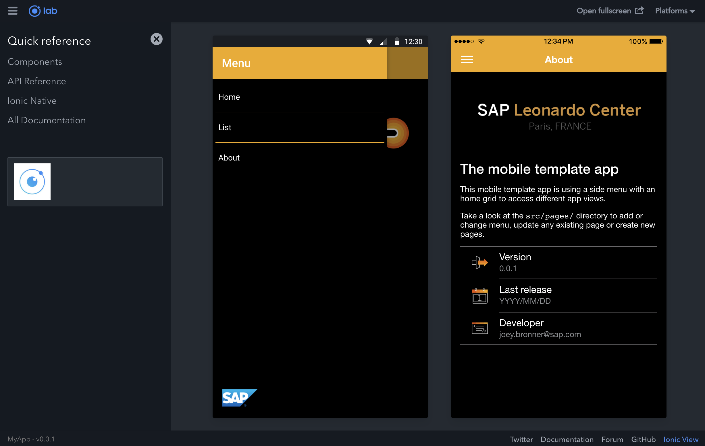

# Leonardo Center Paris - Mobile App Template

Template for multi platform mobile applications for Leonardo Center Paris team.

#### Preview



Links:

[Ionic Components](https://ionicframework.com/docs/api/components)
[Consuming REST API](https://www.djamware.com/post/58b6e81980aca7432b5ff57a/ionic-2-consuming-rest-api)

### Install:

```bash
$ sudo npm install -g ionic cordova
```

### Run

```bash
$ ionic serve --lab
```

### Evolution 

Create a new page: [Tutorial](http://blog.ionic.io/10-minutes-with-ionic-2-adding-pages-and-navigation/)  
Don't forget to modify the **src/app/app.module.ts**. 

```bash
$ ionic g page <pagename>
```

### Deploy

##### Android

Plug an Android phone to your USB

```bash
$ ionic cordova platform add android
$ ionic cordova run android
```

##### iOS

```bash
$ ionic cordova platform add ios
$ ionic cordova run ios
```